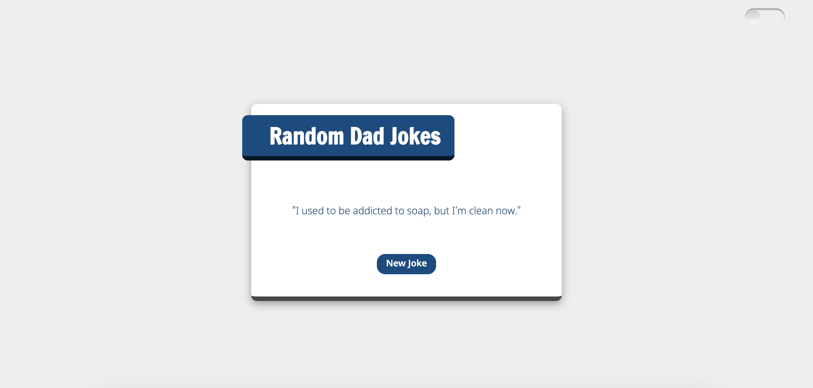

# Dad Jokes

Dad Jokes is a simple web application that lets you brighten your day with random dad jokes. Additionally, it includes a Dark Mode feature for a more comfortable viewing experience.



## Features

- Random Dad Jokes: Fetch and display hilarious dad jokes from the icanhazdadjoke.com API.

- Dark Mode: Toggle between light and dark themes to suit your preference.

## Technologies 

- **HTML5**
- **CSS3**
- **TypeScript**

## Installation

1. Clone the repository:  
   ```bash
   git clone https://github.com/LorenaSTN/dad-jokes.git

2. Navigate to the project directory:
    ```bash
    cd dad-jokes

## Credits 

Lorena Sánchez-Toril
[Linkedin](https://www.linkedin.com/in/lorena-sancheztoril/)


